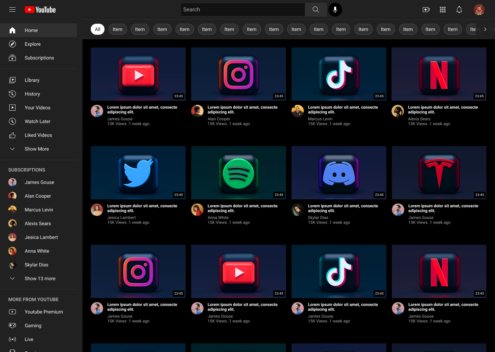
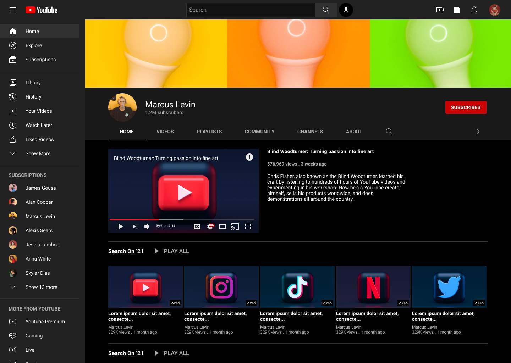
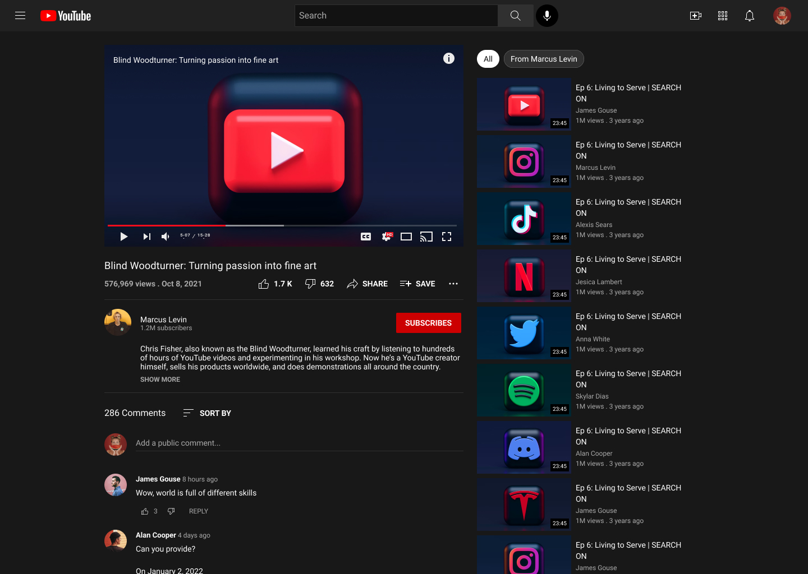

# YouTube UI Clone

This project is a clone of the YouTube interface, built using Next.js, TypeScript, and styled with Tailwind CSS.

## Overview

This project involves translating a UI/UX design template from the provided [Figma link](https://www.figma.com/community/file/1039193156346432955/youtube-ui-clone-design) into a frontend application using Next.js. The goal is to replicate the functionality and user experience of the official YouTube website.

**Live URL:** <https://youtube-ui-nextjs.vercel.app/>

## Features

The application allows users to navigate the YouTube Channel from the sidebar, see related video content, and view playlists. The interface is responsive on mobile, tablet, and desktop.

On the sidebar, click on `Marcus Levin` in **SUBSCRIPTIONS** to navigate to the channel page, then click on the current video to go to the video page.

<div align="left">
<h3>Home</h3>


<h3>Channel</h3>


<h3>Video</h3>

</div>


## Built With

- [Next.js](https://nextjs.org/)
- [TypeScript](https://www.typescriptlang.org/)
- [Tailwind CSS](https://tailwindcss.com/)

## Installation and Setup

1. Clone the repository:

```bash
git clone https://github.com/frankiefab100/youtube-ui-nextjs.git
```

2. Navigate to the project directory:

```bash
cd youtube-ui-nextjs
```

3. Install dependencies:

```bash
npm install
```

4. Run the development server:

```bash
npm run dev
```

Open <http://localhost:3000> with your browser to see the result.
